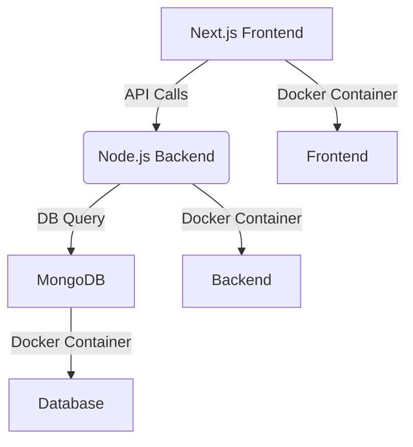

# Fullstack CRUD Microservice App

A Dockerized full-stack microservice application built with:

- **Frontend**: [Next.js](https://nextjs.org/)
- **Backend**: Node.js + Express
- **Database**: MongoDB

This app supports a complete CRUD flow for a `User` entity and is production-ready using Docker Compose.

---

## Features

- CRUD operations on `User` entity
- Validations on both frontend & backend
- RESTful API structure
- Dockerized microservices for frontend, backend, and DB
- Scalable and ready for multi-pod deployment

---

## Tech Stack

| Layer      | Technology     |
|------------|----------------|
| Frontend   | Next.js        |
| Backend    | Node.js + Express |
| Database   | MongoDB        |
| Container  | Docker + Docker Compose |

---

## Getting Started (Production)

### 1️⃣ Clone the Repo

```bash
git clone https://github.com/your-username/your-repo-name.git
cd your-repo-name
```

---

### 2️⃣ Create Production `.env` Files

#### `backend/.env.prod`

```env
PORT=5000
MONGO_URI=mongodb://mongo:27017/users_db
NODE_ENV=production
```

#### `frontend/.env.prod`

```env
NEXT_PUBLIC_API_URL=http://backend:5000/api
NODE_ENV=production
```

---

### 3️⃣ Build and Run with Docker Compose (Production)

```bash
docker-compose -f docker-compose.prod.yml up --build
```

---

### Stop & Clean Containers

```bash
docker-compose -f docker-compose.prod.yml down
```

---

## API Endpoints

| Method | Endpoint        | Description         |
|--------|------------------|---------------------|
| GET    | `/api/users`     | List all users      |
| GET    | `/api/users/:id` | Get user by ID      |
| POST   | `/api/users`     | Create new user     |
| PUT    | `/api/users/:id` | Update user         |
| DELETE | `/api/users/:id` | Delete user         |

---

## Production Environment Configuration

These are injected from Docker Compose automatically:

### backend/.env.prod

```env
PORT=5000
MONGO_URI=mongodb://mongo:27017/users_db
```

### frontend/.env.prod

```env
NEXT_PUBLIC_API_URL=http://backend:5000/api
```

---

## Dockerized Architecture



---

## Folder Structure

```
project-root/
├── backend/
│   ├── Dockerfile
│   ├── .env.prod
│   └── ...
├── frontend/
│   ├── Dockerfile
│   ├── .env.prod
│   └── ...
├── docker-compose.prod.yml
├── README.md
```

---

## Validations (Backend & Frontend)

- `user`: required string
- `interest`: array of strings (min 1)
- `age`: integer (1–120)
- `mobile`: numeric (10+ digits)
- `email`: valid format

---

## Contact

Made with love for technical assessment or deployment-ready microservice architecture.
